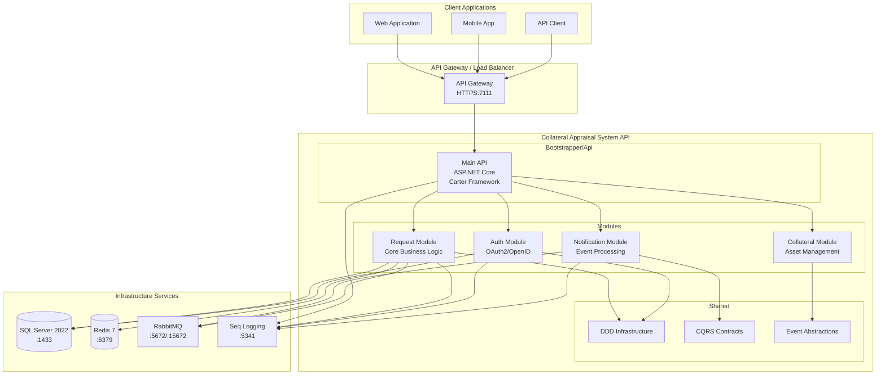
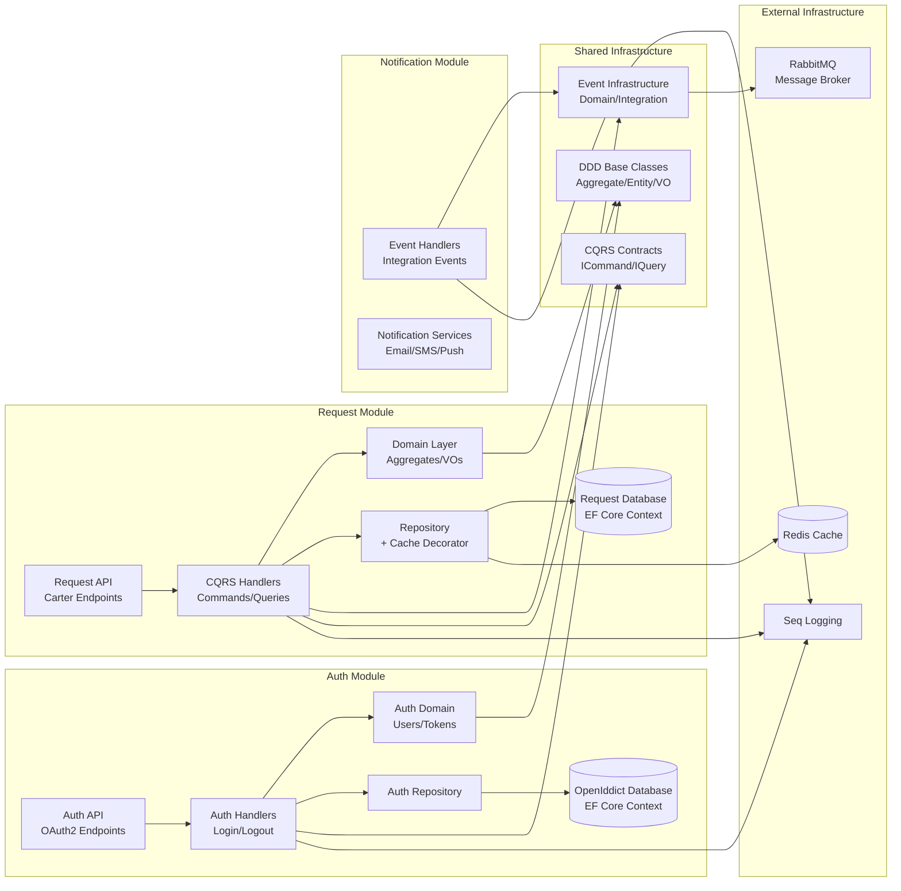
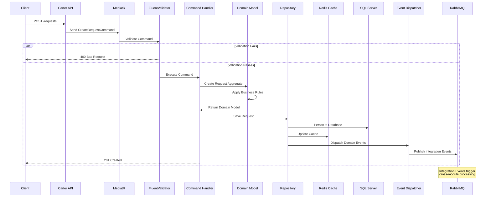
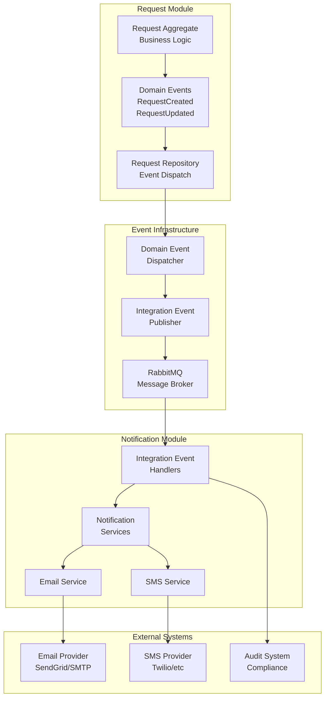
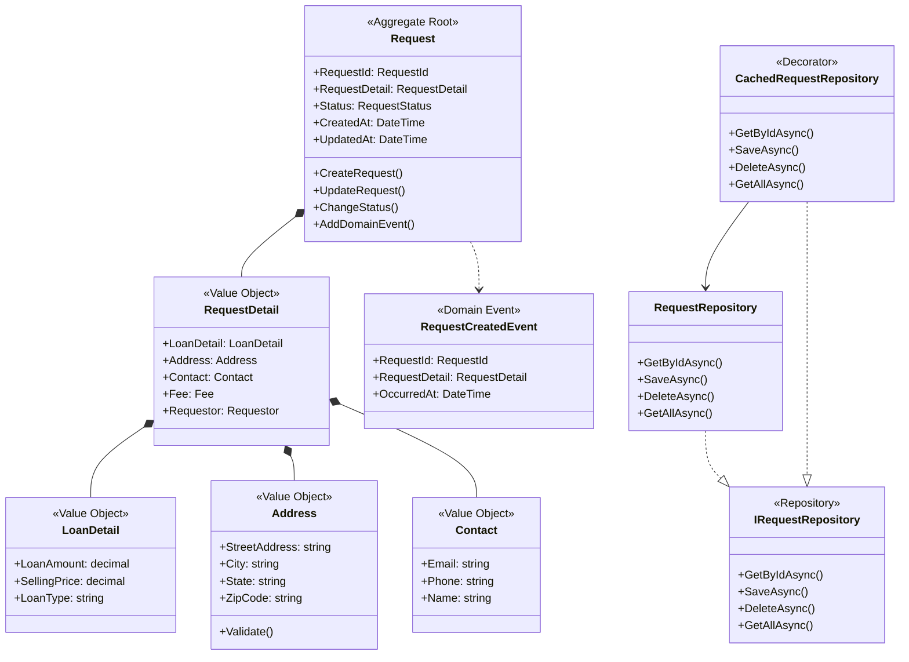
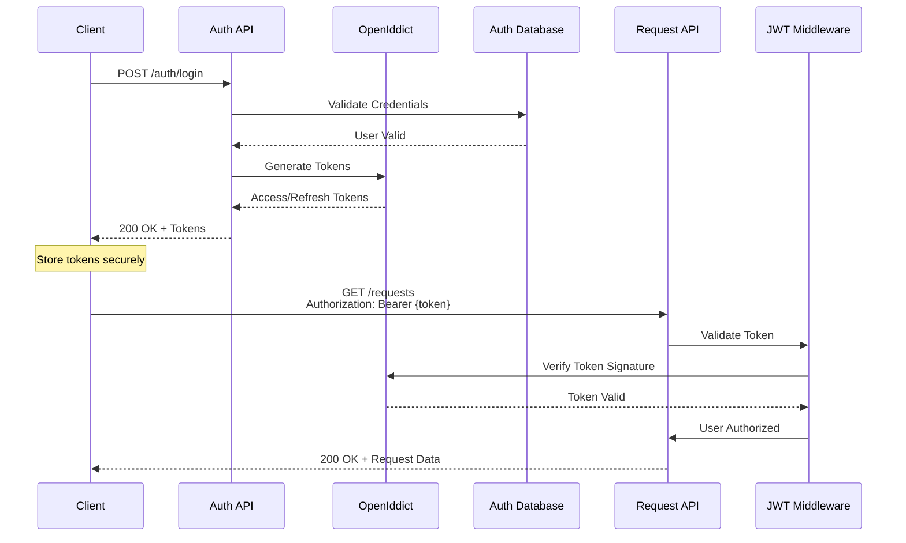
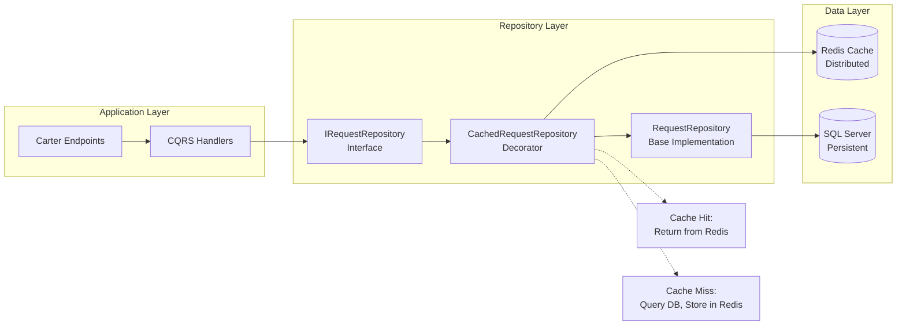
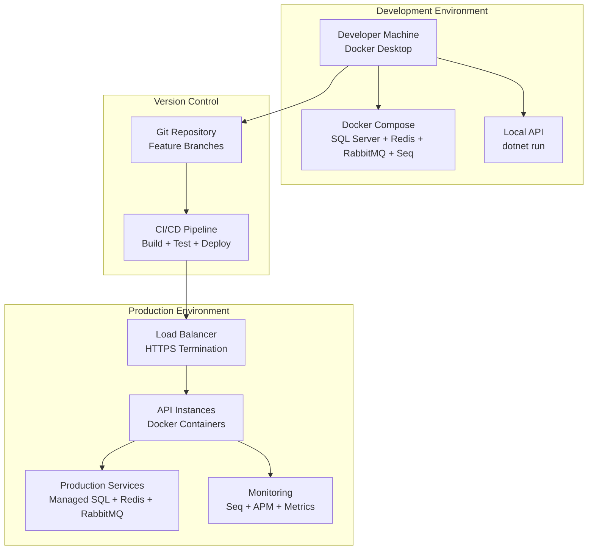

# Architecture Diagrams for Collateral Appraisal System API

## 1. High-Level System Architecture

## 2. Module Boundaries and Dependencies

## 3. CQRS Data Flow

## 4. Event-Driven Architecture Flow

## 5. Domain-Driven Design Structure

## 6. Authentication and Authorization Flow

## 7. Caching Strategy

## 8. Development and Deployment Architecture

