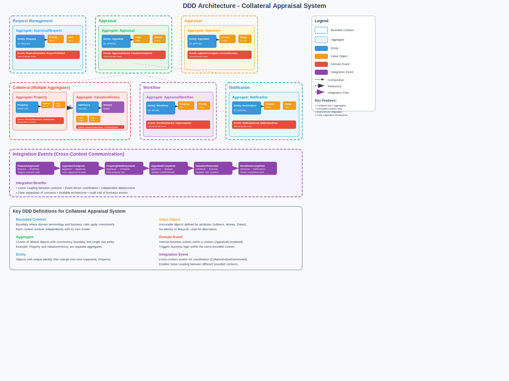

# 🧠 What is Domain-Driven Design (DDD)?
DDD is a way to design software based on the business domain. The idea is to model your code closely to the real-world business you're solving problems for, using Ubiquitous Language, Bounded Contexts, and rich domain models.

# 📚 Key Concepts of DDD



## Ubiquitous Language
Ubiquitous Language is a shared language between developers and domain experts. It helps everyone understand the domain better and ensures that the code reflects the business concepts accurately.
## Bounded Contexts
Bounded Contexts are boundaries within which a particular model is defined and applicable. They help to separate different parts of the system, allowing teams to work independently on different contexts without confusion.

Example:
`Loan`, `Collateral`, `CustomerProfile`, and `RiskEvaluation` may be separate Bounded Contexts in your bank system.

## Entities and Value Objects
Entities are objects that have a distinct identity and lifecycle, while Value Objects are immutable objects that describe characteristics or attributes without an identity. Entities can change over time, while Value Objects are defined by their attributes.

### Entity
- Has identity (ID) that stays the same over time.
- Can change values, but is still the same "thing".

```csharp
public class AppraisalRequest
{
public Guid Id { get; private set; }
public RequestDetail Detail { get; private set; }
public DateTime CreatedAt { get; private set; }

    public void UpdatePurpose(string newPurpose)
    {
        Detail = Detail.WithNewPurpose(newPurpose); // assuming immutable VO
    }
}
```

### Value Object
- No identity, defined by its attributes.
- Immutable, meaning once created, it cannot change.

```csharp
public record RequestDetail(string Purpose, string Channel)
{
    public RequestDetail WithNewPurpose(string newPurpose) =>
        this with { Purpose = newPurpose };
}
```

## Aggregates
Aggregates are clusters of related entities and value objects that are treated as a single unit for data changes. They help maintain consistency within the domain model by defining boundaries for transactions.

Example:
`AppraisalRequest` is the root; you update `RequestDetail` only through it.

## Domain Events
Domain Events are events that signify a change in the state of the domain. They help to decouple different parts of the system and allow for asynchronous processing of changes.

Example:
`AppraisalRequestSubmitted`, `AppraisalCompleted`.


## Repositories
Repositories are responsible for retrieving and storing aggregates. They provide an abstraction layer over the data storage, allowing the domain model to remain clean and focused on business logic.

- Abstracts database.
- Deals only with aggregate roots.

```csharp
public interface IAppraisalRequestRepository
{
    AppraisalRequest? GetById(Guid id);
    void Add(AppraisalRequest request);
    void Save(AppraisalRequest request);
}
```

```csharp
// Infrastructure Layer
public class EfAppraisalRequestRepository : IAppraisalRequestRepository
{
    private readonly AppraisalDbContext _context;

    public EfAppraisalRequestRepository(AppraisalDbContext context)
    {
        _context = context;
    }

    public AppraisalRequest? GetById(Guid id)
    {
        return _context.AppraisalRequests
            .Include(r => r.SomeChildEntityIfNeeded)
            .FirstOrDefault(r => r.Id == id);
    }

    public void Add(AppraisalRequest request)
    {
        _context.AppraisalRequests.Add(request);
    }

    public void Update(AppraisalRequest request)
    {
        _context.AppraisalRequests.Update(request);
    }
}
```

## Domain Services
Services are domain logic that doesn't naturally fit within an entity or value object. They encapsulate business operations and can be used to coordinate actions across multiple aggregates or entities.

```csharp
public class ValuationService
{
    public decimal EstimateValue(IEnumerable<Collateral> comps) { ... }
}
```

## Factories
Factories are responsible for creating complex objects or aggregates. They encapsulate the creation logic, ensuring that the domain model remains clean and focused on business rules rather than instantiation details.


# 🔷 DDD Learning Roadmap
## 1. Core DDD Concepts
- ✅ Entity, Value Object, Aggregate Root
- ✅ Domain Service vs Application Service
- ✅ Repository Pattern
- ✅ Ubiquitous Language
- ✅ Aggregate Lifecycle

## 2. Strategic DDD
- ✅ Bounded Contexts
- ✅ Context Maps (how domains relate to each other)
- ✅ Ubiquitous Language per context
- ✅ Anti-corruption layer (ACL)
- ✅ Domain Model Evolution Strategies
- ✅ Context Integration Patterns

## 3. Tactical Patterns in Depth
- ✅ Aggregate design best practices (invariants, consistency boundaries)
- ✅ Factory Pattern vs Constructor
- ✅ Domain Events: modeling and raising them properly
- ✅ Specification Pattern for reusable business rules
- ✅ Event Sourcing (optional if you want advanced audit)
- ✅ Unit of Work Pattern
- ✅ Soft Delete Implementation
- ✅ Optimistic Concurrency Control
- ✅ Domain Model Validation

## 4. Modular Monolith / Vertical Slice Architecture
- How to align modules = bounded contexts
- How to make vertical slice folders clean (feature → domain + app)
- Decoupling via interfaces and domain-only dependencies

## 5. DDD + CQRS + Event-Driven Design
- Use Command = change, Query = read
- Handlers work with aggregates via repo
- Raise Domain Events, publish Integration Events
- Orchestrate workflows with Domain Event Handlers

# 🚀 Advanced DDD Patterns and Best Practices

## Domain Events - Advanced Implementation
Domain Events are first-class citizens in this system with automatic dispatch and integration event translation.

### Domain Event Infrastructure
```csharp
// Base domain event with metadata
public interface IDomainEvent : INotification
{
    Guid EventId => Guid.NewGuid();
    public DateTime OccurredOn => DateTime.Now;
    public string EventType => GetType().AssemblyQualifiedName!;
}

// Aggregate manages its own events
public abstract class Aggregate<TId> : Entity<TId>, IAggregate<TId>
{
    public readonly List<IDomainEvent> _domainEvents = new();
    public IReadOnlyList<IDomainEvent> DomainEvents => _domainEvents.AsReadOnly();
    
    public void AddDomainEvent(IDomainEvent domainEvent) => _domainEvents.Add(domainEvent);
    public IDomainEvent[] ClearDomainEvents() 
    {
        var events = _domainEvents.ToArray();
        _domainEvents.Clear();
        return events;
    }
}
```

### Event Dispatch Pattern
Events are automatically dispatched during save operations:
```csharp
public class DispatchDomainEventInterceptor(IMediator mediator) : SaveChangesInterceptor
{
    public override async ValueTask<InterceptionResult<int>> SavingChangesAsync(...)
    {
        await DispatchDomainEvents(eventData.Context);
        return await base.SavingChangesAsync(eventData, result, cancellationToken);
    }
}
```

### Domain-to-Integration Event Translation
Domain events are translated to integration events for cross-module communication:
```csharp
public class RequestCreatedEventHandler : INotificationHandler<RequestCreatedEvent>
{
    public async Task Handle(RequestCreatedEvent notification, CancellationToken cancellationToken)
    {
        var integrationEvent = new RequestCreatedIntegrationEvent
        {
            RequestId = notification.Request.Id,
            Purpose = notification.Request.Detail.Purpose
        };
        await bus.Publish(integrationEvent, cancellationToken);
    }
}
```

## Repository Pattern with Decorators
The system implements the decorator pattern for cross-cutting concerns like caching:

```csharp
// Repository registration with decorator
services.AddScoped<IRequestRepository, RequestRepository>();
services.Decorate<IRequestRepository, CachedRequestRepository>();

// Caching decorator implementation
public class CachedRequestRepository(IRequestRepository repository, IDistributedCache cache) 
    : IRequestRepository
{
    public async Task<Request> GetRequest(long requestId, bool asNoTracking = true, ...)
    {
        if (!asNoTracking) return await repository.GetRequest(requestId, asNoTracking, cancellationToken);
        
        var cachedRequest = await cache.GetStringAsync(requestId.ToString(), cancellationToken);
        if (!string.IsNullOrEmpty(cachedRequest))
            return JsonSerializer.Deserialize<Request>(cachedRequest)!;
            
        var request = await repository.GetRequest(requestId, asNoTracking, cancellationToken);
        await cache.SetStringAsync(requestId.ToString(), JsonSerializer.Serialize(request), cancellationToken);
        
        return request;
    }
}
```

## Value Object Design Patterns

### Factory Methods with Validation
```csharp
public record RequestDetail
{
    private RequestDetail(string purpose, bool hasAppraisalBook, ...) { }
    
    // Factory method enforces invariants
    public static RequestDetail Of(string purpose, bool hasAppraisalBook, ...)
    {
        ArgumentNullException.ThrowIfNull(purpose);
        ArgumentNullException.ThrowIfNull(priority);
        
        return new RequestDetail(purpose, hasAppraisalBook, ...);
    }
    
    // Immutable updates
    public RequestDetail WithNewPurpose(string newPurpose) =>
        Of(newPurpose, HasAppraisalBook, Priority, ...);
}
```

### Composite Value Objects
```csharp
public record LoanDetail(string? LoanApplicationNo, decimal? LimitAmt, decimal? TotalSellingPrice);
public record Address(string Street, string City, string State, string ZipCode);
public record Contact(string ContactPersonName, string ContactPersonContactNo, string? ProjectCode);
```

## Aggregate Invariants and Business Rules

### Encapsulated State Changes
```csharp
public class Request : Aggregate<long>
{
    private readonly List<RequestCustomer> _customers = [];
    public IReadOnlyList<RequestCustomer> Customers => _customers.AsReadOnly();
    
    // Business rule enforcement
    public void AddCustomer(RequestCustomer customer)
    {
        ArgumentNullException.ThrowIfNull(customer);
        
        if (_customers.Any(c => c.Id == customer.Id))
            throw new InvalidOperationException("Customer already exists in the request.");
            
        _customers.Add(customer);
    }
    
    // Status transitions with business rules
    public void UpdateStatus(string status)
    {
        ArgumentException.ThrowIfNullOrEmpty(status);
        
        // Add business rule validation here
        Status = status;
    }
}
```

### Rich Entity Behavior
```csharp
public class RequestCustomer : Entity<long>
{
    public void Update(string name, string contactNumber)
    {
        ArgumentException.ThrowIfNullOrEmpty(name);
        ArgumentException.ThrowIfNullOrEmpty(contactNumber);
        
        Name = name;
        ContactNumber = contactNumber;
    }
}
```

## Domain Services and Cross-Cutting Concerns

### Validation Pipeline as Domain Service
```csharp
public class ValidationBehavior<TRequest, TResponse> : IPipelineBehavior<TRequest, TResponse> 
    where TRequest : ICommand<TResponse>
{
    public async Task<TResponse> Handle(TRequest request, RequestHandlerDelegate<TResponse> next, CancellationToken cancellationToken)
    {
        var context = new ValidationContext<TRequest>(request);
        var validationResults = await Task.WhenAll(validators.Select(v => v.ValidateAsync(context, cancellationToken)));
        var failures = validationResults.SelectMany(r => r.Errors).Where(f => f is not null).ToList();
        
        if (failures.Count > 0)
            throw new ValidationException(failures);
            
        return await next(cancellationToken);
    }
}
```

### Audit Trail Pattern
```csharp
public class AuditableEntityInterceptor : SaveChangesInterceptor
{
    private void UpdateEntities(DbContext? context)
    {
        foreach (var entry in context.ChangeTracker.Entries<IEntity>())
        {
            if (entry.State == EntityState.Added)
            {
                entry.Entity.CreatedOn = DateTime.Now;
                entry.Entity.CreatedBy = "System";
            }
            if (entry.State == EntityState.Added || entry.State == EntityState.Modified)
            {
                entry.Entity.UpdatedOn = DateTime.Now;
                entry.Entity.UpdatedBy = "System";
            }
        }
    }
}
```

## CQRS Implementation Patterns

### Command/Query Separation
```csharp
// Command interfaces
public interface ICommand<out TResponse> : IRequest<TResponse> { }
public interface ICommand : ICommand<Unit> { }

// Query interface
public interface IQuery<out T> : IRequest<T> where T : notnull { }

// Command implementation
public record CreateRequestCommand(...) : ICommand<CreateRequestResult>;

// Command handler
internal class CreateRequestHandler : ICommandHandler<CreateRequestCommand, CreateRequestResult>
{
    public async Task<CreateRequestResult> Handle(CreateRequestCommand command, CancellationToken cancellationToken)
    {
        var request = CreateNewRequest(command);
        dbContext.Requests.Add(request);
        await dbContext.SaveChangesAsync(cancellationToken);
        return new CreateRequestResult(request.Id);
    }
}
```

## Domain Exception Handling

### Domain-Specific Exceptions
```csharp
public class RequestNotFoundException(long id) : NotFoundException("Request", id) { }

public class NotFoundException : Exception
{
    public NotFoundException(string name, object key) : base($"{name} ({key}) not found.") { }
}

// Usage in domain
public void UpdateRequest(long id, RequestDetail detail)
{
    var request = requests.FirstOrDefault(r => r.Id == id) 
        ?? throw new RequestNotFoundException(id);
    
    request.UpdateDetail(detail);
}
```

## Integration Events for Cross-Module Communication

### Integration Event Base Class
```csharp
public record IntegrationEvent
{
    public Guid EventId => Guid.NewGuid();
    public DateTime OccurredOn => DateTime.Now;
    public string EventType => GetType().AssemblyQualifiedName;
}

// Cross-module event
public record RequestCreatedIntegrationEvent : IntegrationEvent
{
    public long RequestId { get; set; }
    public string Purpose { get; set; }
    public string Channel { get; set; }
}
```

### Event Consumers
```csharp
public class RequestCreatedIntegrationEventHandler : IConsumer<RequestCreatedIntegrationEvent>
{
    public async Task Consume(ConsumeContext<RequestCreatedIntegrationEvent> context)
    {
        // Handle cross-module concerns
        var message = context.Message;
        // Process the event...
    }
}
```

# 🔧 Missing Tactical Patterns

## Unit of Work Pattern

Manage transaction boundaries and ensure consistency:

```csharp
// Unit of Work interface
public interface IUnitOfWork : IDisposable
{
    Task<int> SaveChangesAsync(CancellationToken cancellationToken = default);
    Task BeginTransactionAsync(CancellationToken cancellationToken = default);
    Task CommitTransactionAsync(CancellationToken cancellationToken = default);
    Task RollbackTransactionAsync(CancellationToken cancellationToken = default);
}

// Implementation with EF Core
public class EfUnitOfWork : IUnitOfWork
{
    private readonly DbContext _context;
    private IDbContextTransaction? _transaction;

    public EfUnitOfWork(DbContext context)
    {
        _context = context;
    }

    public async Task<int> SaveChangesAsync(CancellationToken cancellationToken = default)
    {
        return await _context.SaveChangesAsync(cancellationToken);
    }

    public async Task BeginTransactionAsync(CancellationToken cancellationToken = default)
    {
        _transaction = await _context.Database.BeginTransactionAsync(cancellationToken);
    }

    public async Task CommitTransactionAsync(CancellationToken cancellationToken = default)
    {
        if (_transaction != null)
        {
            await _transaction.CommitAsync(cancellationToken);
            await _transaction.DisposeAsync();
            _transaction = null;
        }
    }

    public async Task RollbackTransactionAsync(CancellationToken cancellationToken = default)
    {
        if (_transaction != null)
        {
            await _transaction.RollbackAsync(cancellationToken);
            await _transaction.DisposeAsync();
            _transaction = null;
        }
    }

    public void Dispose()
    {
        _transaction?.Dispose();
        _context?.Dispose();
    }
}

// Usage in application service
public class TransferRequestHandler : ICommandHandler<TransferRequestCommand>
{
    private readonly IUnitOfWork _unitOfWork;
    private readonly IRequestRepository _requestRepository;
    private readonly ICustomerRepository _customerRepository;

    public async Task Handle(TransferRequestCommand command, CancellationToken cancellationToken)
    {
        await _unitOfWork.BeginTransactionAsync(cancellationToken);
        
        try
        {
            // Multiple aggregate operations in single transaction
            var request = await _requestRepository.GetById(command.RequestId);
            var customer = await _customerRepository.GetById(command.NewCustomerId);
            
            request.TransferToCustomer(customer.Id);
            customer.AddRequest(request.Id);
            
            await _requestRepository.Save(request);
            await _customerRepository.Save(customer);
            
            await _unitOfWork.SaveChangesAsync(cancellationToken);
            await _unitOfWork.CommitTransactionAsync(cancellationToken);
        }
        catch
        {
            await _unitOfWork.RollbackTransactionAsync(cancellationToken);
            throw;
        }
    }
}
```

## Soft Delete Implementation

Maintain audit trail without physical deletion:

```csharp
// Soft delete interface
public interface ISoftDelete
{
    bool IsDeleted { get; }
    DateTime? DeletedOn { get; }
    string? DeletedBy { get; }
    
    void Delete(string deletedBy);
    void Restore();
}

// Base entity with soft delete
public abstract class AuditableEntity<TId> : Entity<TId>, ISoftDelete
{
    public bool IsDeleted { get; private set; }
    public DateTime? DeletedOn { get; private set; }
    public string? DeletedBy { get; private set; }
    
    public DateTime CreatedOn { get; private set; }
    public string CreatedBy { get; private set; }
    public DateTime? UpdatedOn { get; private set; }
    public string? UpdatedBy { get; private set; }

    public virtual void Delete(string deletedBy)
    {
        if (IsDeleted) return;
        
        IsDeleted = true;
        DeletedOn = DateTime.UtcNow;
        DeletedBy = deletedBy;
    }

    public virtual void Restore()
    {
        IsDeleted = false;
        DeletedOn = null;
        DeletedBy = null;
    }
}

// Domain implementation
public class Request : AuditableEntity<long>
{
    // Override to add business rules
    public override void Delete(string deletedBy)
    {
        if (Status == "Approved")
            throw new InvalidOperationException("Cannot delete approved requests");
            
        base.Delete(deletedBy);
        AddDomainEvent(new RequestDeletedEvent(Id, deletedBy));
    }
}

// EF Core interceptor for soft delete
public class SoftDeleteInterceptor : SaveChangesInterceptor
{
    public override InterceptionResult<int> SavingChanges(DbContextEventData eventData, InterceptionResult<int> result)
    {
        if (eventData.Context is null) return result;
        
        HandleSoftDelete(eventData.Context);
        return result;
    }

    private static void HandleSoftDelete(DbContext context)
    {
        var softDeleteEntries = context.ChangeTracker.Entries<ISoftDelete>()
            .Where(e => e.State == EntityState.Deleted && !e.Entity.IsDeleted);

        foreach (var entry in softDeleteEntries)
        {
            entry.State = EntityState.Modified;
            entry.Entity.Delete("System"); // Or get from current user context
        }
    }
}

// Global query filter in DbContext
protected override void OnModelCreating(ModelBuilder modelBuilder)
{
    // Apply soft delete filter globally
    foreach (var entityType in modelBuilder.Model.GetEntityTypes())
    {
        if (typeof(ISoftDelete).IsAssignableFrom(entityType.ClrType))
        {
            var parameter = Expression.Parameter(entityType.ClrType, "e");
            var property = Expression.Property(parameter, nameof(ISoftDelete.IsDeleted));
            var filter = Expression.Lambda(Expression.Not(property), parameter);
            modelBuilder.Entity(entityType.ClrType).HasQueryFilter(filter);
        }
    }
}

// Repository with soft delete support
public class RequestRepository : IRequestRepository
{
    private readonly DbContext _context;

    // Normal operations automatically filter deleted entities
    public async Task<Request?> GetById(long id)
    {
        return await _context.Requests.FirstOrDefaultAsync(r => r.Id == id);
        // IsDeleted filter applied automatically
    }

    // Include deleted entities when needed
    public async Task<Request?> GetByIdIncludeDeleted(long id)
    {
        return await _context.Requests
            .IgnoreQueryFilters()
            .FirstOrDefaultAsync(r => r.Id == id);
    }
}
```

## Optimistic Concurrency Control

Prevent lost updates with version control:

```csharp
// Aggregate with version control
public abstract class Aggregate<TId> : Entity<TId>
{
    public int Version { get; private set; }
    
    protected void IncrementVersion()
    {
        Version++;
    }
    
    // Called before any state change
    protected void EnsureNotStale(int expectedVersion)
    {
        if (Version != expectedVersion)
            throw new ConcurrencyException($"Expected version {expectedVersion}, but current version is {Version}");
    }
}

// Domain implementation
public class Request : Aggregate<long>
{
    public void UpdateStatus(string newStatus, int expectedVersion)
    {
        EnsureNotStale(expectedVersion);
        
        // Business logic
        if (!CanTransitionTo(newStatus))
            throw new InvalidOperationException($"Cannot transition from {Status} to {newStatus}");
            
        Status = newStatus;
        IncrementVersion();
        
        AddDomainEvent(new RequestStatusChangedEvent(Id, Status, newStatus));
    }
}

// EF Core configuration
protected override void OnModelCreating(ModelBuilder modelBuilder)
{
    modelBuilder.Entity<Request>(entity =>
    {
        // Configure version as concurrency token
        entity.Property(e => e.Version)
              .IsConcurrencyToken()
              .HasDefaultValue(0);
    });
}

// Command with version
public record UpdateRequestStatusCommand(long RequestId, string Status, int ExpectedVersion) 
    : ICommand<UpdateRequestStatusResult>;

// Handler with concurrency check
public class UpdateRequestStatusHandler : ICommandHandler<UpdateRequestStatusCommand, UpdateRequestStatusResult>
{
    public async Task<UpdateRequestStatusResult> Handle(UpdateRequestStatusCommand command, CancellationToken cancellationToken)
    {
        var request = await _repository.GetById(command.RequestId);
        
        try
        {
            request.UpdateStatus(command.Status, command.ExpectedVersion);
            await _repository.Save(request);
            
            return new UpdateRequestStatusResult(request.Id, request.Version);
        }
        catch (DbUpdateConcurrencyException)
        {
            throw new ConcurrencyException("Request was modified by another user. Please refresh and try again.");
        }
    }
}

// Custom concurrency exception
public class ConcurrencyException : DomainException
{
    public ConcurrencyException(string message) : base(message) { }
}
```

## Domain Model Validation

Comprehensive validation strategies:

```csharp
// Validation interface
public interface IValidator<T>
{
    ValidationResult Validate(T entity);
}

// Domain validation result
public class ValidationResult
{
    public bool IsValid => Errors.Count == 0;
    public List<ValidationError> Errors { get; } = new();
    
    public void AddError(string property, string message)
    {
        Errors.Add(new ValidationError(property, message));
    }
    
    public void AddErrors(ValidationResult other)
    {
        Errors.AddRange(other.Errors);
    }
}

public record ValidationError(string Property, string Message);

// Domain-specific validator
public class RequestValidator : IValidator<Request>
{
    public ValidationResult Validate(Request request)
    {
        var result = new ValidationResult();
        
        // Required field validation
        if (string.IsNullOrEmpty(request.Detail.Purpose))
            result.AddError(nameof(request.Detail.Purpose), "Purpose is required");
            
        // Business rule validation
        if (request.Detail.LoanDetail?.LimitAmt <= 0)
            result.AddError(nameof(request.Detail.LoanDetail.LimitAmt), "Loan amount must be positive");
            
        // Status transition validation
        if (request.Status == "Submitted" && request.Customers.Count == 0)
            result.AddError(nameof(request.Customers), "Submitted request must have at least one customer");
            
        // Cross-property validation
        if (request.Detail.LoanDetail?.LimitAmt > request.Detail.LoanDetail?.TotalSellingPrice)
            result.AddError("LoanDetails", "Loan amount cannot exceed property value");
            
        return result;
    }
}

// Aggregate with validation
public class Request : Aggregate<long>
{
    private readonly IValidator<Request> _validator;
    
    public void Submit()
    {
        // Validate before state change
        var validationResult = _validator.Validate(this);
        if (!validationResult.IsValid)
            throw new ValidationException(validationResult.Errors);
            
        if (Status != "Draft")
            throw new InvalidOperationException("Only draft requests can be submitted");
            
        Status = "Submitted";
        AddDomainEvent(new RequestSubmittedEvent(this));
    }
}

// Validation exception
public class ValidationException : DomainException
{
    public List<ValidationError> Errors { get; }
    
    public ValidationException(List<ValidationError> errors) 
        : base($"Validation failed: {string.Join(", ", errors.Select(e => $"{e.Property}: {e.Message}"))}")
    {
        Errors = errors;
    }
}

// Fluent validation integration
public class CreateRequestCommandValidator : AbstractValidator<CreateRequestCommand>
{
    public CreateRequestCommandValidator()
    {
        RuleFor(x => x.Purpose)
            .NotEmpty()
            .WithMessage("Purpose is required");
            
        RuleFor(x => x.LoanAmount)
            .GreaterThan(0)
            .WithMessage("Loan amount must be positive")
            .LessThanOrEqualTo(10000000)
            .WithMessage("Loan amount exceeds maximum limit");
            
        RuleFor(x => x)
            .Must(HaveValidLoanToValueRatio)
            .WithMessage("Loan to value ratio exceeds acceptable limit");
    }
    
    private bool HaveValidLoanToValueRatio(CreateRequestCommand command)
    {
        if (command.LoanAmount <= 0 || command.PropertyValue <= 0) return true;
        
        var ltvRatio = command.LoanAmount / command.PropertyValue;
        return ltvRatio <= 0.95m; // 95% max LTV
    }
}

// Validation pipeline behavior
public class ValidationBehavior<TRequest, TResponse> : IPipelineBehavior<TRequest, TResponse>
    where TRequest : ICommand<TResponse>
{
    private readonly IEnumerable<IValidator<TRequest>> _validators;

    public async Task<TResponse> Handle(TRequest request, RequestHandlerDelegate<TResponse> next, CancellationToken cancellationToken)
    {
        if (_validators.Any())
        {
            var context = new ValidationContext<TRequest>(request);
            var results = await Task.WhenAll(_validators.Select(v => v.ValidateAsync(context, cancellationToken)));
            var failures = results.SelectMany(r => r.Errors).Where(f => f != null).ToList();

            if (failures.Count > 0)
                throw new FluentValidation.ValidationException(failures);
        }

        return await next();
    }
}
```

# 🚨 DDD Anti-Patterns to Avoid

## ❌ Anemic Domain Model
Don't create entities that only have getters/setters without behavior:
```csharp
// BAD - Anemic
public class Request
{
    public string Status { get; set; }
    public void SetStatus(string status) => Status = status;
}

// GOOD - Rich Domain Model
public class Request
{
    public string Status { get; private set; }
    public void Submit() 
    {
        if (Status != "Draft") throw new InvalidOperationException();
        Status = "Submitted";
        AddDomainEvent(new RequestSubmittedEvent(this));
    }
}
```

## ❌ Repository as Data Access Layer
Don't expose IQueryable or database-specific concerns:
```csharp
// BAD
public interface IRequestRepository
{
    IQueryable<Request> GetAll();
    void ExecuteSql(string sql);
}

// GOOD
public interface IRequestRepository
{
    Task<Request> GetById(long id);
    Task<IEnumerable<Request>> GetByStatus(string status);
    Task Save(Request request);
}
```

## ❌ God Aggregates
Don't create aggregates that manage too many entities:
```csharp
// BAD - Too many responsibilities
public class Request
{
    public List<Customer> AllCustomers { get; set; }
    public List<Product> AllProducts { get; set; }
    public List<Order> AllOrders { get; set; }
    // ... hundreds of properties
}

// GOOD - Focused aggregate
public class Request
{
    public RequestDetail Detail { get; private set; }
    public List<RequestCustomer> Customers { get; private set; }
    // Only what's needed for request consistency
}
```

## ❌ Domain Logic in Application Services
Keep domain logic in the domain layer:
```csharp
// BAD - Business logic in application service
public class CreateRequestHandler
{
    public async Task Handle(CreateRequestCommand command)
    {
        if (command.Purpose == "Loan" && command.Amount > 1000000)
            throw new Exception("Loan amount too high");
        
        var request = new Request();
        request.Purpose = command.Purpose;
        // ... more business logic
    }
}

// GOOD - Domain logic in aggregate
public class Request
{
    public static Request CreateLoanRequest(string purpose, decimal amount)
    {
        if (purpose == "Loan" && amount > 1000000)
            throw new DomainException("Loan amount exceeds limit");
        
        return new Request(purpose, amount);
    }
}
```

# 🎯 Advanced DDD Concepts

## Specification Pattern
Use specifications for complex business rules and query conditions:

```csharp
public abstract class Specification<T>
{
    public abstract bool IsSatisfiedBy(T entity);
    public abstract Expression<Func<T, bool>> ToExpression();
    
    public Specification<T> And(Specification<T> other) => new AndSpecification<T>(this, other);
    public Specification<T> Or(Specification<T> other) => new OrSpecification<T>(this, other);
}

// Business rule as specification
public class HighValueRequestSpecification : Specification<Request>
{
    public override bool IsSatisfiedBy(Request request)
    {
        return request.Detail.LoanDetail?.LimitAmt > 1000000;
    }
    
    public override Expression<Func<Request, bool>> ToExpression()
    {
        return r => r.Detail.LoanDetail.LimitAmt > 1000000;
    }
}

// Usage in domain service
public class RequestApprovalService
{
    public bool RequiresSpecialApproval(Request request)
    {
        var highValueSpec = new HighValueRequestSpecification();
        var urgentSpec = new UrgentRequestSpecification();
        
        return highValueSpec.Or(urgentSpec).IsSatisfiedBy(request);
    }
}
```

## Domain Service vs Application Service

### Domain Service
Contains business logic that doesn't naturally fit within an entity:
```csharp
public class RequestValidationService
{
    public ValidationResult ValidateForSubmission(Request request)
    {
        var errors = new List<string>();
        
        if (string.IsNullOrEmpty(request.Detail.Purpose))
            errors.Add("Purpose is required for submission");
            
        if (request.Customers.Count == 0)
            errors.Add("At least one customer is required");
            
        return new ValidationResult(errors);
    }
}
```

### Application Service
Orchestrates the use case without business logic:
```csharp
public class SubmitRequestHandler : ICommandHandler<SubmitRequestCommand>
{
    public async Task Handle(SubmitRequestCommand command, CancellationToken cancellationToken)
    {
        // 1. Load aggregate
        var request = await repository.GetById(command.RequestId);
        
        // 2. Validate using domain service
        var validationResult = domainService.ValidateForSubmission(request);
        if (!validationResult.IsValid)
            throw new ValidationException(validationResult.Errors);
        
        // 3. Execute domain behavior
        request.Submit();
        
        // 4. Save aggregate
        await repository.Save(request);
    }
}
```

## Bounded Context Integration Patterns

### Anti-Corruption Layer (ACL)
Protect your domain from external systems:
```csharp
public class ExternalRiskAssessmentService
{
    public async Task<DomainRiskScore> GetRiskScore(Request request)
    {
        // Call external service
        var externalScore = await externalApi.CalculateRisk(request.Detail.Purpose);
        
        // Translate to domain model (ACL)
        return externalScore.Rating switch
        {
            "HIGH" => DomainRiskScore.High,
            "MEDIUM" => DomainRiskScore.Medium,
            "LOW" => DomainRiskScore.Low,
            _ => DomainRiskScore.Unknown
        };
    }
}
```

### Context Mapping
Define relationships between bounded contexts:
```csharp
// Shared kernel - common concepts across contexts
public record CustomerId(long Value);

// Request context
public class RequestCustomer : Entity<long>
{
    public CustomerId CustomerId { get; private set; }
    public string Name { get; private set; }
}

// Customer context (separate bounded context)
public class Customer : Aggregate<CustomerId>
{
    public PersonalInfo PersonalInfo { get; private set; }
    public CreditHistory CreditHistory { get; private set; }
}
```

# 🗺️ Strategic DDD - Advanced Concepts

## Bounded Context Design Principles

### What Makes a Good Bounded Context

A bounded context should have:
- **Single Responsibility**: One cohesive business capability
- **Autonomous Team**: Can be developed independently
- **Clear Language**: Unambiguous terms within the context
- **Data Ownership**: Owns its data and business rules

### Identifying Context Boundaries

```csharp
// ❌ BAD - Mixed concerns in one context
public class CustomerOrderSystem
{
    // Customer management (Identity context)
    public void RegisterCustomer(Customer customer) { }
    public void UpdateCustomerProfile(Customer customer) { }
    
    // Order processing (Sales context)
    public void CreateOrder(Order order) { }
    public void ProcessPayment(Payment payment) { }
    
    // Inventory management (Inventory context)
    public void UpdateStock(Product product, int quantity) { }
    public void ReserveItems(OrderItem[] items) { }
}

// ✅ GOOD - Separate bounded contexts
namespace IdentityManagement
{
    public class CustomerService
    {
        public void RegisterCustomer(Customer customer) { }
        public void UpdateProfile(CustomerId id, PersonalInfo info) { }
    }
}

namespace SalesManagement  
{
    public class OrderService
    {
        public void CreateOrder(CustomerId customerId, OrderDetails details) { }
        public void ProcessPayment(OrderId orderId, PaymentInfo payment) { }
    }
}

namespace InventoryManagement
{
    public class StockService
    {
        public void UpdateStock(ProductId id, StockLevel level) { }
        public void ReserveItems(ReservationRequest request) { }
    }
}
```

## Context Integration Patterns

### 1. Shared Kernel
Common domain concepts shared between contexts:

```csharp
// Shared Kernel - Common across Request and Collateral contexts
namespace Shared.Domain
{
    public record CustomerId(long Value);
    public record PropertyAddress(string Street, string City, string State, string ZipCode);
    public record MonetaryAmount(decimal Value, string Currency = "USD");
}

// Request Context uses shared concepts
namespace RequestManagement.Domain
{
    public class Request : Aggregate<long>
    {
        public CustomerId CustomerId { get; private set; }
        public PropertyAddress PropertyAddress { get; private set; }
        public MonetaryAmount LoanAmount { get; private set; }
    }
}

// Collateral Context uses same shared concepts  
namespace CollateralManagement.Domain
{
    public class Collateral : Aggregate<long> 
    {
        public PropertyAddress Address { get; private set; }
        public MonetaryAmount EstimatedValue { get; private set; }
    }
}
```

### 2. Customer-Supplier Pattern
One context depends on another:

```csharp
// Supplier: Risk Assessment Context
namespace RiskAssessment.Domain
{
    public class RiskScore : ValueObject
    {
        public int Score { get; private set; }
        public RiskLevel Level { get; private set; }
        
        public static RiskScore Calculate(decimal amount, CustomerProfile profile)
        {
            // Risk calculation logic
            var score = CalculateRiskScore(amount, profile);
            return new RiskScore { Score = score, Level = DetermineLevel(score) };
        }
    }
}

// Customer: Request Context consumes risk data
namespace RequestManagement.Domain  
{
    public class RequestApprovalService
    {
        private readonly IRiskAssessmentService _riskService;
        
        public async Task<ApprovalDecision> EvaluateRequest(Request request)
        {
            // Call supplier context
            var riskScore = await _riskService.AssessRisk(request.CustomerId, request.LoanAmount);
            
            return riskScore.Level switch
            {
                RiskLevel.High => ApprovalDecision.RequiresManualReview,
                RiskLevel.Medium => ApprovalDecision.ConditionalApproval,
                RiskLevel.Low => ApprovalDecision.AutoApproved,
                _ => ApprovalDecision.Rejected
            };
        }
    }
}
```

### 3. Conformist Pattern
Adapt to external system's model:

```csharp
// External credit bureau system (we have no control)
public class ExternalCreditReport
{
    public string SSN { get; set; }
    public int FICO_SCORE { get; set; }
    public string CREDIT_STATUS { get; set; } // "GOOD", "BAD", "UNKNOWN"
}

// Our domain model (conformist adaptation)
namespace CreditManagement.Domain
{
    public class CreditReport : ValueObject
    {
        public SocialSecurityNumber SSN { get; private set; }
        public CreditScore Score { get; private set; }
        public CreditStatus Status { get; private set; }
        
        // Factory method adapts external format to our domain
        public static CreditReport FromExternal(ExternalCreditReport external)
        {
            return new CreditReport
            {
                SSN = SocialSecurityNumber.From(external.SSN),
                Score = CreditScore.From(external.FICO_SCORE),
                Status = external.CREDIT_STATUS switch
                {
                    "GOOD" => CreditStatus.Good,
                    "BAD" => CreditStatus.Poor,
                    _ => CreditStatus.Unknown
                }
            };
        }
    }
}
```

## Domain Model Evolution Strategies

### 1. Versioning Domain Events

```csharp
// V1 - Initial event
public record CustomerRegisteredEventV1 : IDomainEvent
{
    public long CustomerId { get; init; }
    public string Name { get; init; }
    public string Email { get; init; }
}

// V2 - Added phone number
public record CustomerRegisteredEventV2 : IDomainEvent
{
    public long CustomerId { get; init; }
    public string FirstName { get; init; }
    public string LastName { get; init; }
    public string Email { get; init; }
    public string? PhoneNumber { get; init; }
}

// Event handler supports both versions
public class CustomerRegisteredEventHandler : 
    INotificationHandler<CustomerRegisteredEventV1>,
    INotificationHandler<CustomerRegisteredEventV2>
{
    public async Task Handle(CustomerRegisteredEventV1 notification, CancellationToken cancellationToken)
    {
        // Handle V1 format
        await ProcessRegistration(notification.CustomerId, notification.Name, notification.Email, null);
    }
    
    public async Task Handle(CustomerRegisteredEventV2 notification, CancellationToken cancellationToken)
    {
        // Handle V2 format
        var fullName = $"{notification.FirstName} {notification.LastName}";
        await ProcessRegistration(notification.CustomerId, fullName, notification.Email, notification.PhoneNumber);
    }
}
```

### 2. Aggregate Schema Evolution

```csharp
// Evolution of Request aggregate
public class Request : Aggregate<long>
{
    // Original properties
    public RequestDetail Detail { get; private set; }
    public string Status { get; private set; }
    
    // Added in V2 - nullable for backward compatibility
    public ApprovalWorkflow? Workflow { get; private set; }
    
    // Added in V3 - collection with default empty
    private readonly List<RequestNote> _notes = new();
    public IReadOnlyList<RequestNote> Notes => _notes.AsReadOnly();
    
    // Migration method for loading legacy data
    public void ApplyLegacyMigration()
    {
        // Initialize new properties for old aggregates
        if (Workflow == null)
        {
            Workflow = ApprovalWorkflow.CreateDefault(Status);
        }
    }
}
```

### 3. Database Schema Migration Strategy

```csharp
// EF Core migration with backward compatibility
public partial class AddWorkflowToRequest : Migration
{
    protected override void Up(MigrationBuilder migrationBuilder)
    {
        // Add new columns as nullable
        migrationBuilder.AddColumn<string>(
            name: "Workflow_CurrentStep",
            table: "Requests", 
            nullable: true);
            
        migrationBuilder.AddColumn<DateTime>(
            name: "Workflow_StartedAt",
            table: "Requests",
            nullable: true);
        
        // Populate default values for existing records
        migrationBuilder.Sql(@"
            UPDATE Requests 
            SET Workflow_CurrentStep = 'Initial', 
                Workflow_StartedAt = CreatedOn 
            WHERE Workflow_CurrentStep IS NULL");
    }
}
```

## Ubiquitous Language Management

### 1. Language Evolution Process

```csharp
// Glossary as code - maintains domain vocabulary
public static class AppraisalDomainGlossary
{
    public const string REQUEST = "A formal application for property appraisal services";
    public const string COLLATERAL = "Property or asset securing a loan obligation";
    public const string APPRAISAL = "Professional valuation of property worth";
    public const string LOAN_TO_VALUE = "Ratio of loan amount to appraised property value";
    
    // Deprecated terms - maintain for backward compatibility
    [Obsolete("Use 'Request' instead of 'Application'")]
    public const string APPLICATION = REQUEST;
    
    // Evolution tracking
    public record TermEvolution(string OldTerm, string NewTerm, string Reason, DateTime ChangedOn);
    
    public static readonly TermEvolution[] LanguageEvolution = 
    {
        new("Application", "Request", "Clearer business intent", new DateTime(2024, 1, 15)),
        new("Asset", "Collateral", "Precise legal terminology", new DateTime(2024, 2, 10))
    };
}
```

### 2. Domain Vocabulary in Code

```csharp
// Domain language reflected in code
namespace AppraisalManagement.Domain
{
    // Use business terms, not technical terms
    public class AppraisalRequest // Not "AppraisalEntity" or "AppraisalModel"
    {
        public RequestPurpose Purpose { get; private set; } // Not "Type" or "Category"
        public PropertyDetails Property { get; private set; } // Not "Asset" or "Item"
        
        // Methods use business language
        public void SubmitForReview() { } // Not "SetStatusToReview()"
        public void AssignAppraiser(AppraiserId appraiser) { } // Not "UpdateAssignee()"
        public void CompleteAppraisal(AppraisalReport report) { } // Not "Finalize()"
    }
    
    // Enums use domain language
    public enum RequestPurpose
    {
        PurchaseLoan,           // Not "Type1"
        RefinanceLoan,          // Not "Type2"  
        HomeEquityLine,         // Not "Type3"
        CollateralReview        // Not "Type4"
    }
}
```

### 3. Cross-Context Language Translation

```csharp
// Translation between contexts with different languages
public class RequestToLoanTranslationService
{
    // Request context uses "Request"
    // Loan context uses "Application"
    public LoanApplication TranslateToLoanContext(AppraisalRequest request)
    {
        return new LoanApplication
        {
            // Translate domain concepts
            ApplicationId = request.Id,
            LoanPurpose = TranslatePurpose(request.Purpose),
            PropertyInformation = TranslateProperty(request.Property),
            Applicant = TranslateCustomer(request.Customer)
        };
    }
    
    private LoanPurpose TranslatePurpose(RequestPurpose purpose) => purpose switch
    {
        RequestPurpose.PurchaseLoan => LoanPurpose.Purchase,
        RequestPurpose.RefinanceLoan => LoanPurpose.Refinance,
        RequestPurpose.HomeEquityLine => LoanPurpose.HomeEquity,
        RequestPurpose.CollateralReview => LoanPurpose.Evaluation,
        _ => throw new ArgumentException($"Unknown purpose: {purpose}")
    };
}
```

## Event Sourcing Concepts
For advanced audit and state reconstruction:

```csharp
// Stream-based aggregate
public class RequestAggregate : IEventSourcedAggregate
{
    private readonly List<IDomainEvent> _events = new();
    public IEnumerable<IDomainEvent> Events => _events;
    
    public static RequestAggregate FromHistory(IEnumerable<IDomainEvent> events)
    {
        var aggregate = new RequestAggregate();
        foreach (var @event in events)
        {
            aggregate.Apply(@event);
        }
        return aggregate;
    }
    
    private void Apply(IDomainEvent @event)
    {
        switch (@event)
        {
            case RequestCreatedEvent e:
                ApplyRequestCreated(e);
                break;
            case RequestStatusChangedEvent e:
                ApplyStatusChanged(e);
                break;
        }
    }
}
```

## Aggregate Design Guidelines

### 🎯 Keep Aggregates Small
- Focus on consistency boundaries
- Avoid large object graphs
- Use eventual consistency between aggregates

### 🎯 Aggregate Invariants
```csharp
public class Request : Aggregate<long>
{
    private void EnsureInvariants()
    {
        if (Status == "Submitted" && Customers.Count == 0)
            throw new DomainException("Submitted request must have customers");
            
        if (Detail.LoanDetail?.LimitAmt <= 0)
            throw new DomainException("Loan amount must be positive");
    }
    
    public void Submit()
    {
        Status = "Submitted";
        EnsureInvariants(); // Validate before state change
        AddDomainEvent(new RequestSubmittedEvent(this));
    }
}
```

### 🎯 Optimistic Concurrency
```csharp
public class Request : Aggregate<long>
{
    public int Version { get; private set; }
    
    public void UpdateVersion()
    {
        Version++;
    }
}

// In repository
public async Task Save(Request request)
{
    try
    {
        request.UpdateVersion();
        context.Update(request);
        await context.SaveChangesAsync();
    }
    catch (DbUpdateConcurrencyException)
    {
        throw new ConcurrencyException("Request was modified by another user");
    }
}
```

# 🏗️ Infrastructure Patterns & Best Practices

## Testing DDD Applications

### Unit Testing Aggregates

```csharp
// Aggregate unit tests
public class RequestAggregateTests
{
    [Test]
    public void Submit_WithValidRequest_ShouldChangeStatusAndRaiseDomainEvent()
    {
        // Arrange
        var request = Request.Create(RequestDetail.Of("Purchase", true, "High", "Contact"));
        request.AddCustomer(RequestCustomer.Of("John Doe", "123-456-7890"));
        
        // Act
        request.Submit();
        
        // Assert
        request.Status.Should().Be("Submitted");
        request.DomainEvents.Should().ContainSingle(e => e is RequestSubmittedEvent);
    }
    
    [Test]
    public void Submit_WithoutCustomers_ShouldThrowDomainException()
    {
        // Arrange
        var request = Request.Create(RequestDetail.Of("Purchase", true, "High", "Contact"));
        
        // Act & Assert
        var act = () => request.Submit();
        act.Should().Throw<InvalidOperationException>()
           .WithMessage("*customers*");
    }
    
    [Test]
    public void UpdateStatus_WithInvalidTransition_ShouldThrowException()
    {
        // Arrange
        var request = Request.Create(RequestDetail.Of("Purchase", true, "High", "Contact"));
        request.Submit(); // Status becomes "Submitted"
        
        // Act & Assert
        var act = () => request.UpdateStatus("Draft");
        act.Should().Throw<InvalidOperationException>();
    }
}
```

### Integration Testing with Test Containers

```csharp
// Integration test base class
public abstract class IntegrationTestBase : IAsyncLifetime
{
    protected readonly MsSqlContainer _sqlContainer;
    protected readonly IServiceProvider _serviceProvider;
    protected readonly ITestDatabase _database;

    protected IntegrationTestBase()
    {
        _sqlContainer = new MsSqlBuilder()
            .WithPassword("P@ssw0rd123")
            .WithCleanUp(true)
            .Build();
    }

    public async Task InitializeAsync()
    {
        await _sqlContainer.StartAsync();
        
        var services = new ServiceCollection();
        services.AddDbContext<RequestDbContext>(options =>
            options.UseSqlServer(_sqlContainer.GetConnectionString()));
        
        _serviceProvider = services.BuildServiceProvider();
        _database = _serviceProvider.GetRequiredService<ITestDatabase>();
        
        await _database.InitializeAsync();
    }

    public async Task DisposeAsync()
    {
        await _sqlContainer.DisposeAsync();
    }
}

// Feature integration test
public class CreateRequestIntegrationTests : IntegrationTestBase
{
    [Test]
    public async Task CreateRequest_WithValidData_ShouldPersistAndRaiseDomainEvent()
    {
        // Arrange
        var command = new CreateRequestCommand("Purchase", true, "High", "Online");
        var handler = _serviceProvider.GetRequiredService<CreateRequestHandler>();
        
        // Act
        var result = await handler.Handle(command, CancellationToken.None);
        
        // Assert
        result.Should().NotBeNull();
        result.Id.Should().BeGreaterThan(0);
        
        // Verify persistence
        var repository = _serviceProvider.GetRequiredService<IRequestRepository>();
        var savedRequest = await repository.GetById(result.Id);
        savedRequest.Should().NotBeNull();
        savedRequest.Detail.Purpose.Should().Be("Purchase");
    }
}
```

## Performance Considerations

### N+1 Query Prevention

```csharp
// ❌ BAD - Causes N+1 queries
public class RequestService
{
    public async Task<IEnumerable<RequestSummary>> GetRequestSummaries()
    {
        var requests = await _context.Requests.ToListAsync();
        
        var summaries = new List<RequestSummary>();
        foreach (var request in requests)
        {
            // This causes N additional queries
            var customerCount = await _context.RequestCustomers
                .CountAsync(c => c.RequestId == request.Id);
                
            summaries.Add(new RequestSummary(request.Id, request.Status, customerCount));
        }
        
        return summaries;
    }
}

// ✅ GOOD - Single query with projection
public class RequestService
{
    public async Task<IEnumerable<RequestSummary>> GetRequestSummaries()
    {
        return await _context.Requests
            .Select(r => new RequestSummary(
                r.Id,
                r.Status,
                r.Customers.Count))
            .ToListAsync();
    }
}
```

### Query Optimization with Specifications

```csharp
// Optimized query specification
public class ActiveRequestsWithCustomersSpec : Specification<Request>
{
    public override Expression<Func<Request, bool>> ToExpression()
    {
        return r => r.Status != "Cancelled" && r.Status != "Completed";
    }
    
    // Include related data for efficient loading
    public IQueryable<Request> Apply(IQueryable<Request> query)
    {
        return query
            .Where(ToExpression())
            .Include(r => r.Customers)
            .Include(r => r.Detail)
            .AsNoTracking(); // Read-only optimization
    }
}

// Usage in repository
public async Task<List<Request>> GetActiveRequestsWithCustomers()
{
    var spec = new ActiveRequestsWithCustomersSpec();
    return await spec.Apply(_context.Requests).ToListAsync();
}
```

### Caching Strategies

```csharp
// Distributed caching decorator
public class CachedRequestRepository : IRequestRepository
{
    private readonly IRequestRepository _repository;
    private readonly IDistributedCache _cache;
    private readonly ILogger<CachedRequestRepository> _logger;
    private readonly TimeSpan _cacheExpiry = TimeSpan.FromMinutes(30);

    public async Task<Request?> GetById(long id)
    {
        var cacheKey = $"request:{id}";
        
        // Try cache first
        var cachedJson = await _cache.GetStringAsync(cacheKey);
        if (!string.IsNullOrEmpty(cachedJson))
        {
            _logger.LogDebug("Cache hit for request {RequestId}", id);
            return JsonSerializer.Deserialize<Request>(cachedJson);
        }
        
        // Load from repository
        var request = await _repository.GetById(id);
        if (request != null)
        {
            // Cache the result
            var serialized = JsonSerializer.Serialize(request);
            await _cache.SetStringAsync(cacheKey, serialized, new DistributedCacheEntryOptions
            {
                AbsoluteExpirationRelativeToNow = _cacheExpiry
            });
            
            _logger.LogDebug("Cached request {RequestId}", id);
        }
        
        return request;
    }
    
    public async Task Save(Request request)
    {
        await _repository.Save(request);
        
        // Invalidate cache
        var cacheKey = $"request:{request.Id}";
        await _cache.RemoveAsync(cacheKey);
        
        _logger.LogDebug("Invalidated cache for request {RequestId}", request.Id);
    }
}
```

## Migration Strategies

### From Anemic to Rich Domain Model

```csharp
// Step 1: Current anemic model
public class OldRequest
{
    public long Id { get; set; }
    public string Purpose { get; set; }
    public string Status { get; set; }
    public decimal LoanAmount { get; set; }
    // ... other properties
}

// Step 2: Add behavior incrementally
public class Request
{
    public long Id { get; private set; }
    public string Purpose { get; private set; }
    public string Status { get; private set; }
    public decimal LoanAmount { get; private set; }
    
    // Add business methods one by one
    public void UpdatePurpose(string newPurpose)
    {
        if (string.IsNullOrEmpty(newPurpose))
            throw new ArgumentException("Purpose cannot be empty");
            
        Purpose = newPurpose;
    }
    
    // Migrate existing setters to business methods
    [Obsolete("Use UpdateStatus method instead")]
    public string StatusSetter
    {
        set => Status = value;
    }
    
    public void UpdateStatus(string newStatus)
    {
        ValidateStatusTransition(newStatus);
        Status = newStatus;
    }
    
    private void ValidateStatusTransition(string newStatus)
    {
        var validTransitions = new Dictionary<string, string[]>
        {
            ["Draft"] = ["Submitted", "Cancelled"],
            ["Submitted"] = ["InReview", "Cancelled"],
            ["InReview"] = ["Approved", "Rejected"],
            ["Approved"] = ["Completed"],
            ["Rejected"] = [],
            ["Cancelled"] = [],
            ["Completed"] = []
        };
        
        if (!validTransitions[Status].Contains(newStatus))
            throw new InvalidOperationException($"Cannot transition from {Status} to {newStatus}");
    }
}

// Step 3: Introduce value objects
public record RequestPurpose
{
    public string Value { get; }
    
    private RequestPurpose(string value)
    {
        Value = value;
    }
    
    public static RequestPurpose Of(string value)
    {
        if (string.IsNullOrWhiteSpace(value))
            throw new ArgumentException("Purpose cannot be empty");
            
        return new RequestPurpose(value);
    }
    
    public static implicit operator string(RequestPurpose purpose) => purpose.Value;
}

// Step 4: Final rich domain model
public class Request : Aggregate<long>
{
    public RequestPurpose Purpose { get; private set; }
    public RequestStatus Status { get; private set; }
    public MonetaryAmount LoanAmount { get; private set; }
    
    public void UpdatePurpose(RequestPurpose newPurpose)
    {
        Purpose = newPurpose;
        AddDomainEvent(new RequestPurposeChangedEvent(Id, Purpose));
    }
}
```

## Team Collaboration Patterns

### Domain Expert Collaboration

```csharp
// Domain concepts dictionary maintained with experts
public static class LoanProcessingGlossary
{
    // Terms verified with business experts
    public const string APPRAISAL = "Professional assessment of property value by licensed appraiser";
    public const string LTV_RATIO = "Loan-to-Value ratio: loan amount divided by appraised value";
    public const string DTI_RATIO = "Debt-to-Income ratio: monthly debt payments divided by gross monthly income";
    
    // Business rules as executable specifications
    public static class BusinessRules
    {
        public static bool IsHighRiskLoan(decimal loanAmount, decimal propertyValue, decimal borrowerIncome)
        {
            var ltvRatio = loanAmount / propertyValue;
            var incomeRatio = loanAmount / (borrowerIncome * 12); // Annual income
            
            return ltvRatio > 0.80m || incomeRatio > 4.0m;
        }
        
        public static bool RequiresAdditionalDocumentation(RequestPurpose purpose, decimal amount)
        {
            return purpose == RequestPurpose.Investment || amount > 500000m;
        }
    }
}

// Ubiquitous language in tests readable by domain experts
public class LoanProcessingBusinessRuleTests
{
    [Test]
    public void HighValueInvestmentProperty_ShouldRequireAdditionalDocumentation()
    {
        // Arrange
        var purpose = RequestPurpose.Investment;
        var loanAmount = 750000m;
        
        // Act
        var requiresAdditionalDocs = BusinessRules.RequiresAdditionalDocumentation(purpose, loanAmount);
        
        // Assert
        requiresAdditionalDocs.Should().BeTrue("investment properties over $500k need extra documentation");
    }
}
```

### Event Storming Implementation

```csharp
// Events discovered during event storming sessions
namespace LoanProcessing.Events
{
    // Customer journey events
    public record ApplicationStartedEvent(Guid ApplicationId, string CustomerType);
    public record DocumentsUploadedEvent(Guid ApplicationId, DocumentType[] Documents);
    public record PropertyAppraisalRequestedEvent(Guid ApplicationId, string PropertyAddress);
    public record AppraisalCompletedEvent(Guid ApplicationId, decimal AppraisedValue);
    public record UnderwritingStartedEvent(Guid ApplicationId, string UnderwriterId);
    public record LoanApprovedEvent(Guid ApplicationId, decimal ApprovedAmount, string[] Conditions);
    public record LoanRejectedEvent(Guid ApplicationId, string ReasonCode, string ReasonDescription);
    
    // Business process events
    public record RiskAssessmentCompletedEvent(Guid ApplicationId, RiskLevel Risk, decimal Score);
    public record ComplianceCheckCompletedEvent(Guid ApplicationId, bool Passed, string[] Issues);
    public record FraudCheckCompletedEvent(Guid ApplicationId, bool Flagged, string Reason);
}

// Aggregate designed from event storming
public class LoanApplication : Aggregate<Guid>
{
    public ApplicationStatus Status { get; private set; }
    public CustomerInfo Customer { get; private set; }
    public PropertyInfo Property { get; private set; }
    public LoanDetails Loan { get; private set; }
    
    // Commands derived from domain events
    public void StartApplication(CustomerInfo customer, PropertyInfo property, LoanDetails loan)
    {
        Customer = customer;
        Property = property;
        Loan = loan;
        Status = ApplicationStatus.Started;
        
        AddDomainEvent(new ApplicationStartedEvent(Id, customer.Type));
    }
    
    public void RequestAppraisal()
    {
        if (Status != ApplicationStatus.DocumentsComplete)
            throw new InvalidOperationException("Cannot request appraisal until documents are complete");
            
        Status = ApplicationStatus.AppraisalRequested;
        AddDomainEvent(new PropertyAppraisalRequestedEvent(Id, Property.Address));
    }
}
```

# 📋 DDD Implementation Checklist

## ✅ Strategic Patterns
- [ ] Bounded contexts defined and documented
- [ ] Context boundaries clearly identified  
- [ ] Ubiquitous language established per context
- [ ] Context map documented with relationships
- [ ] Anti-corruption layers implemented
- [ ] Integration events for cross-context communication
- [ ] Domain model evolution strategies
- [ ] Language translation between contexts

## ✅ Tactical Patterns
- [ ] Entities with identity and lifecycle
- [ ] Value objects with immutability and validation
- [ ] Aggregates with business invariants
- [ ] Domain events for state changes
- [ ] Repositories for persistence abstraction
- [ ] Domain services for cross-entity logic
- [ ] Specifications for complex business rules
- [ ] Factory methods for complex object creation

## ✅ Advanced Tactical Patterns  
- [ ] Unit of Work pattern for transaction boundaries
- [ ] Soft delete implementation with audit trail
- [ ] Optimistic concurrency control
- [ ] Domain model validation strategies
- [ ] Aggregate lifecycle management
- [ ] Event sourcing for audit requirements
- [ ] Specification pattern for reusable business rules

## ✅ Infrastructure Patterns
- [ ] Domain event dispatch mechanism
- [ ] Audit trail implementation  
- [ ] Caching decorators for repositories
- [ ] Validation pipeline with FluentValidation
- [ ] Exception handling strategy
- [ ] Database schema design for DDD
- [ ] EF Core interceptors for cross-cutting concerns

## ✅ CQRS Integration
- [ ] Command/query separation interfaces
- [ ] Command handlers with validation
- [ ] Query handlers optimized for reads
- [ ] Domain logic in commands only
- [ ] Pipeline behaviors for cross-cutting concerns
- [ ] Command and query validation

## ✅ Performance & Testing
- [ ] N+1 query prevention strategies
- [ ] Query optimization with specifications
- [ ] Distributed caching implementation
- [ ] Unit testing for aggregates
- [ ] Integration testing with test containers
- [ ] Performance monitoring and optimization

## ✅ Team Collaboration
- [ ] Domain expert collaboration patterns
- [ ] Event storming implementation
- [ ] Ubiquitous language in code and tests
- [ ] Business rules as executable specifications
- [ ] Migration strategies from anemic models
- [ ] Code review guidelines for DDD

---
## 🔍 STEP 1: Identify Core DDD Building Blocks in Request Module

We’ll answer:

| Concept                 | Question                                                |
| ----------------------- | ------------------------------------------------------- |
| **Entity**              | What has identity and a lifecycle?                      |
| **Value Object**        | What is descriptive, doesn’t need ID, and is immutable? |
| **Aggregate Root**      | What is the main entry point for request logic?         |
| **Domain Service**      | Any logic that doesn’t belong in a single entity?       |
| **Application Service** | Which handler coordinates the feature logic?            |

### 1. Entity
Has ID, can change over time, must be tracked.

Candidate entities:
- `Request` (main one)
- Maybe `RequestCustomer` (if it changes separately)
- `RequestDocument` (if you update/delete them independently)
These entities are tracked, have IDs, and their identity matters.

These entities are tracked, have IDs, and their identity matters.

```csharp
// Root Entity
public class Request
{
    public Guid Id { get; private set; }

    public RequestDetail Detail { get; private set; } // Value Object
    public RequestStatus Status { get; private set; } // Enum or VO
    public List<RequestDocument> Documents { get; private set; } = new();

    private Request() { } // EF needs this

    public static Request Create(RequestDetail detail)
    {
        return new Request
        {
            Id = Guid.NewGuid(),
            Detail = detail,
            Status = RequestStatus.Draft
        };
    }

    public void UpdateDetail(RequestDetail newDetail)
    {
        if (Status != RequestStatus.Draft)
            throw new InvalidOperationException("Cannot update once submitted.");

        Detail = newDetail;
    }

    public void Submit()
    {
        if (Status != RequestStatus.Draft)
            throw new InvalidOperationException("Only draft can be submitted.");

        Status = RequestStatus.Submitted;
    }

    public void AddDocument(RequestDocument doc)
    {
        Documents.Add(doc);
    }
}
```

### 2. Value Object
Descriptive data. Immutable. No ID needed.

Candidate VOs:
`RequestDetail` (AO code, Branch, Purpose, Channel)
`CustomerContactInfo` (name, email, phone)
`RequestStatus` (could even be an enum-backed value object)

These are perfect for VOs because they only describe the request.

```csharp
public record RequestDetail(
    string Purpose,
    string Channel,
    string AoCode,
    string BranchCode,
    string Department,
    string Section
)
{
    public RequestDetail WithNewPurpose(string newPurpose) =>
        this with { Purpose = newPurpose };
}
```
```csharp
request.UpdateDetail(request.Detail.WithNewPurpose("Collateral Review"));
```

### 3. Aggregate Root
Controls the lifecycle of a cluster of entities/VOs. 

✔ `Request` is the Aggregate Root.

It manages:
- Status transitions
- Document uploads
- Customer detail updates (maybe wrapped as VOs)

Rule: You should only persist/fetch Request, and do all modifications via methods on it.

#### 🏗️ Design Patterns
##### ✅ Pattern: Factory Method for Creation
- Protects from bad object construction
- Avoids partial/inconsistent states

```csharp
public static Request Create(RequestDetail detail)
{
    if (string.IsNullOrWhiteSpace(detail.Purpose))
        throw new ArgumentException("Purpose required");

    return new Request { Id = Guid.NewGuid(), Detail = detail, Status = Draft };
}
```

##### ✅ Pattern: Encapsulate Mutations
Don’t allow setting `Status` or `Detail` from outside. Instead, expose meaningful methods:
```csharp
public void UpdatePurpose(string purpose)
{
    Detail = Detail with { Purpose = purpose };
}
```

##### ✅ Pattern: Collection = Add Method
```csharp
public void AddDocument(RequestDocument document)
{
    if (Status != RequestStatus.Draft)
        throw new InvalidOperationException("Cannot add documents after submission.");

    Documents.Add(document);
}
```


### 4. Domain Service
When logic is not tied to one entity.

Examples:
`RequestFeeCalculator` (logic based on purpose/area/type)

`RequestDocumentValidator` (validates file size/type based on rules)

### 5. Application Service
`SubmitRequestHandler`

`GetRequestByIdHandler`

These coordinate:
- Load aggregate from repository
- Call domain logic
- Save via repository

### Mapping Table

| Concept             | Class Example                  | Why                                |
| ------------------- | ------------------------------ | ---------------------------------- |
| Entity              | `Request`, `RequestDocument`   | Identity + lifecycle               |
| Value Object        | `RequestDetail`, `ContactInfo` | Immutable + descriptive            |
| Aggregate Root      | `Request`                      | Controls changes to entire cluster |
| Domain Service      | `RequestFeeCalculator`         | Business logic outside one entity  |
| Application Service | `SubmitRequestHandler`         | Coordinates the use case           |
